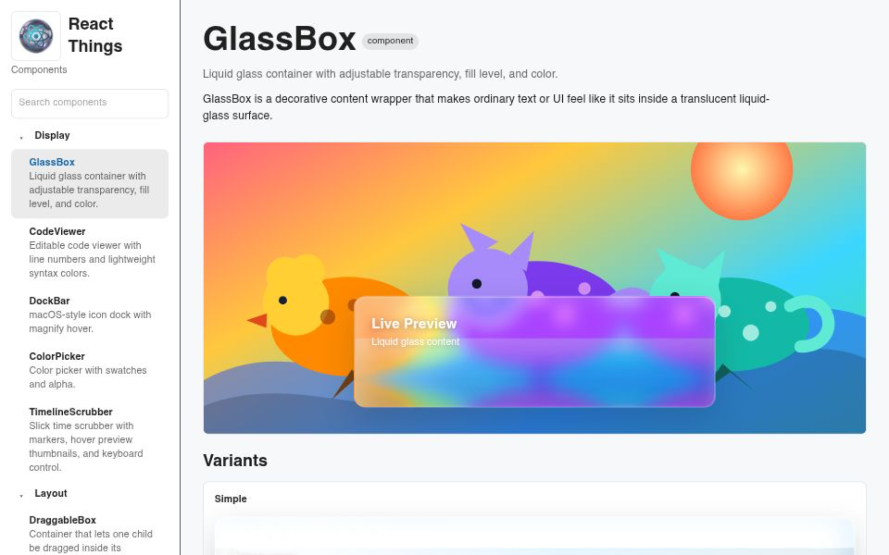

# React Things



https://react-things-ten.vercel.app/?component=GlassBox

Reusable React component library with a Vite demo app.

## Package

```sh
npm install @mickyballadelli/react-things @mui/material @emotion/react @emotion/styled @mui/icons-material
```

```tsx
import { GlassBox } from '@mickyballadelli/react-things'

export function Example() {
  return (
    <GlassBox transparency={0.45} fill={0.62} liquidColor="#38d6a5">
      Liquid glass content
    </GlassBox>
  )
}
```

React and React DOM are peer dependencies.

## Workspaces

- `packages/ui`: component library
- `demo`: Vite + React + Material UI demo app

## Components

- GlassBox: decorative wrapper that makes content look like it sits inside liquid glass.
- DraggableBox: bounded stage where one child can be dragged around.
- CodeViewer: editable code display with line numbers and simple syntax colors.
- DataCardGrid: metric cards with deltas, sparklines, progress, and status color.
- DataLens: tiny table and card viewer with filters, sorting, and inline charts.
- DockBar: icon launcher strip with animated magnify hover.
- DockTabs: browser-like tabs with drag reorder, left-side docking, overflow, and previews.
- CommandDock: persistent left command navigation with icons, tree branches, search, collapse, and saved state.
- CommandPalette: searchable list or tree for commands, docs, and navigation.
- SplitPane: two-panel layout with a draggable divider.
- FloatingToolbar: contextual tool strip anchored to text selection or an element.
- MagneticCard: cursor-reactive card with 3D tilt, lift, and glare.
- MorphMenu: radial action menu that morphs out from its trigger.
- SpotlightPanel: panel that reveals content through a cursor-following light.
- NodeCanvas: diagram workspace with draggable connected nodes.
- BeforeAfterSlider: comparison viewer with a draggable reveal handle.
- InfiniteCanvas: pan-and-zoom workspace for draggable items.
- SmartTooltip: rich tooltip for context, media, actions, copy, and pinning.
- ToastCenter: notification stack with grouped toasts and history drawer.
- TourGuide: product walkthrough with spotlight mask, branches, progress, and completion.
- ResizableFrame: container resized from a corner handle.
- ResizableDashboard: widget dashboard with draggable, resizable, persistent grid layouts.
- InspectorPanel: compact settings form for editing structured props.
- InspectorDrawer: property drawer with sections, live validation, and undo.
- KanbanBoard: editable workflow board with columns, cards, drag and drop, and card editing.
- ColorPicker: controlled color input with swatches and alpha.
- ColorStudio: palette builder with contrast checks, gradients, and token export.
- TimelineScrubber: timeline input for seeking through time-based content.
- FileDropZone: upload target for dragged or selected files.
- FocusRing: animated focus and validation highlight for any target.

## Commands

```sh
npm install
npm run dev
npm run build
```


## Vercel

Deploy from repo root. `vercel.json` builds the library and demo, then serves `demo/dist`.
